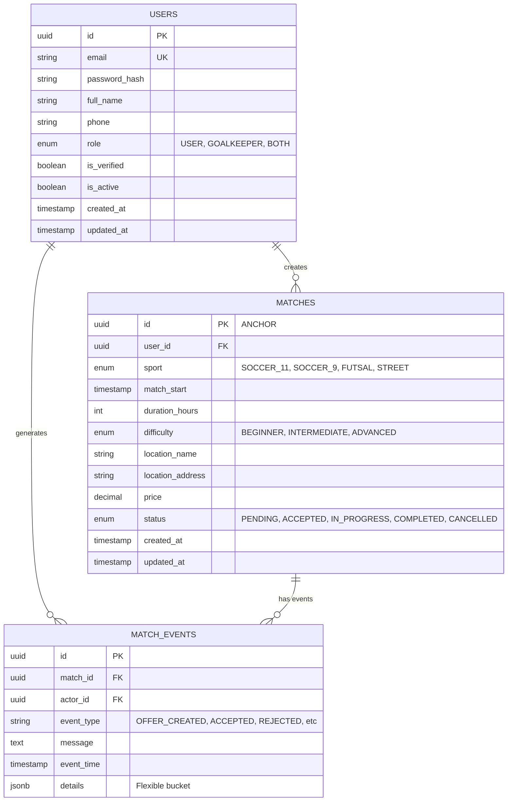

```mermaid

erDiagram
    %% ==========================================
    %% CORE TABLES (Minimal MVP)
    %% ==========================================
    
    USERS {
        uuid id PK
        string email UK
        string password_hash
        string full_name
        string phone
        enum role "USER, GOALKEEPER, BOTH"
        boolean is_verified
        boolean is_active
        timestamp created_at
        timestamp updated_at
    }
    
    MATCHES {
        uuid id PK "ANCHOR"
        uuid user_id FK
        enum sport "SOCCER_11, SOCCER_9, FUTSAL, STREET"
        timestamp match_start
        int duration_hours
        enum difficulty "BEGINNER, INTERMEDIATE, ADVANCED"
        string location_name
        string location_address
        decimal price
        enum status "PENDING, ACCEPTED, IN_PROGRESS, COMPLETED, CANCELLED"
        timestamp created_at
        timestamp updated_at
    }
    
    MATCH_EVENTS {
        uuid id PK
        uuid match_id FK
        uuid actor_id FK
        string event_type "OFFER_CREATED, ACCEPTED, REJECTED, etc"
        text message
        timestamp event_time
        jsonb details "Flexible bucket"
    }
    
    %% ==========================================
    %% RELATIONSHIPS
    %% ==========================================
    
    USERS ||--o{ MATCHES : "creates"
    USERS ||--o{ MATCH_EVENTS : "generates"
    MATCHES ||--o{ MATCH_EVENTS : "has events"
```